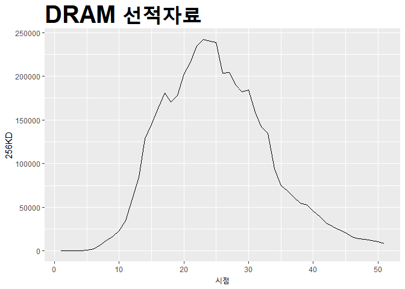
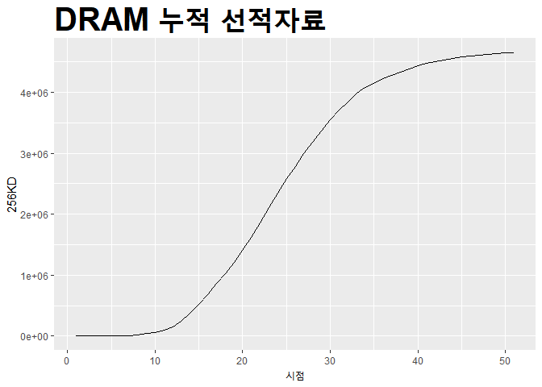
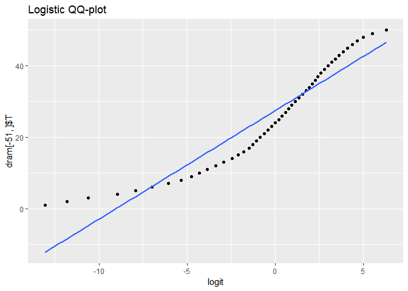
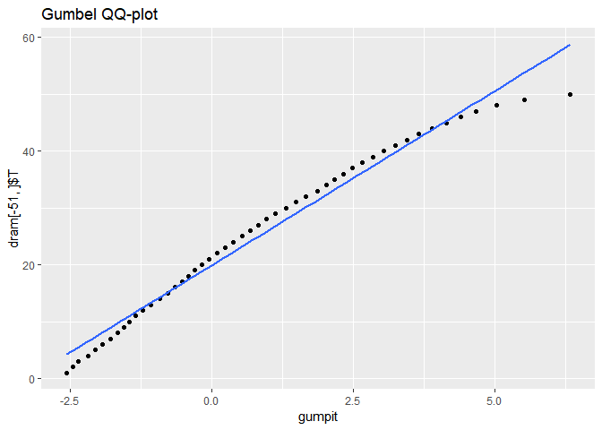

DRAM Prediction
================

### DRAM 수요 예측

``` r
library(ggplot2)
```

    ## Warning: package 'ggplot2' was built under R version 3.5.1

``` r
library(dplyr)
```

    ## Warning: package 'dplyr' was built under R version 3.5.1

    ## 
    ## Attaching package: 'dplyr'

    ## The following objects are masked from 'package:stats':
    ## 
    ##     filter, lag

    ## The following objects are masked from 'package:base':
    ## 
    ##     intersect, setdiff, setequal, union

``` r
dram<-read.table("C:\\Users\\SAMSUNG\\Desktop\\DRAM.csv", sep=",", header=T)
colnames(dram)<-c("T","256KD")
dram <- dram%>%mutate(Y<-cumsum(dram$`256KD`)) 
colnames(dram)<-c("T","S", "Y")

ggplot(dram, aes(x=dram$'T', y=dram$'S'))+geom_line()+ggtitle("DRAM 선적자료")+labs(x="시점", y="256KD") +
  theme(plot.title=element_text(face="bold", size=30, color="black"))
```



``` r
ggplot(dram, aes(x=dram$'T', y=dram$'Y'))+geom_line()+ggtitle("DRAM 누적 선적자료")+labs(x="시점", y="256KD") +
  theme(plot.title=element_text(face="bold", size=30, color="black"))
```



### 총수요(m) 추정하기

#### OLS estimation!

#### 15, 30, 51 days

``` r
dram$Y_lag = lag(dram$Y,1)
dram[is.na(dram)] <- 0
head(dram)
```

    ##   T    S    Y Y_lag
    ## 1 1   10   10     0
    ## 2 2   25   35    10
    ## 3 3   80  115    35
    ## 4 4  480  595   115
    ## 5 5 1115 1710   595
    ## 6 6 2625 4335  1710

``` r
dram_1<-dram[1:15,]; dram_2<-dram[1:30,]; dram_3<-dram[1:51,] 

m<-dram$Y[51]
```

#### BASS

``` r
result <- function(a,b,c,m){
  m1= (-b - sqrt(b^2-4*a*c))/(2*c)
  m2=(-b + sqrt(b^2-4*a*c))/(2*c)
  
  if (m2>0){
    mhat<-m2
  } else mhat<-m1
  mhat<-as.numeric(mhat)
  return (c("mhat"=mhat, "error"=100*(mhat-m)/m))
}

lm1<-lm(S~Y_lag+I((Y_lag)^2), data=dram_1)
lm2<-lm(S~Y_lag+I((Y_lag)^2), data=dram_2)
lm3<-lm(S~Y_lag+I((Y_lag)^2), data=dram_3)

a1<-lm1$coefficients[1]; b1<-lm1$coefficients[2]; c1<-lm1$coefficients[3] 
a2<-lm2$coefficients[1]; b2<-lm2$coefficients[2]; c2<-lm2$coefficients[3] 
a3<-lm3$coefficients[1]; b3<-lm3$coefficients[2]; c3<-lm3$coefficients[3] 

result1_b<-c("p"= a1/result(a1,b1,c1,m)[1], "q"=-c1*result(a1,b1,c1,m)[1], "m"=result(a1,b1,c1,m)[1], "error"=result(a1,b1,c1,m)[2])
result2_b<-c("p"= a2/result(a2,b2,c2,m)[1], "q"=-c2*result(a2,b2,c2,m)[1], "m"=result(a2,b2,c2,m)[1], "error"=result(a2,b2,c2,m)[2])
result3_b<-c("p"= a3/result(a3,b3,c3,m)[1], "q"=-c3*result(a3,b3,c3,m)[1], "m"=result(a3,b3,c3,m)[1], "error"=result(a3,b3,c3,m)[2])
```

#### Logistic

``` r
result2<-function(a,b,m){
  mhat=-a/b
  error=100*(mhat-m)/m
  return (c("mhat"=mhat, "error"=error))
}

lm1<-lm(S~Y_lag+I((Y_lag)^2)-1, data=dram_1)
lm2<-lm(S~Y_lag+I((Y_lag)^2)-1, data=dram_2)
lm3<-lm(S~Y_lag+I((Y_lag)^2)-1, data=dram_3)

a1<-lm1$coefficients[1]; b1<-lm1$coefficients[2]
a2<-lm2$coefficients[1]; b2<-lm2$coefficients[2]
a3<-lm3$coefficients[1]; b3<-lm3$coefficients[2]

result1_lo<-c("q"=a1, "m"=result2(a1,b1,m)[1], "error"=result2(a1,b1,m)[2])
result2_lo<-c("q"=a2, "m"=result2(a2,b2,m)[1], "error"=result2(a2,b2,m)[2])
result3_lo<-c("q"=a3, "m"=result2(a3,b3,m)[1], "error"=result2(a3,b3,m)[2])
```

#### Gumbel

``` r
result3<-function(a,b,m){
  mhat=exp(a/-b)
  error=100*(mhat-m)/m
  return (c("mhat"=mhat, "error"=error))
}


dram <- dram %>%  mutate(Y2=dram$Y_lag*log(dram$Y_lag))
dram_1_clean<-dram[2:15,]; dram_2_clean<-dram[2:30,]; dram_3_clean<-dram[2:51,] 

lm1<-lm(S~Y_lag+Y2-1, data=dram_1_clean)
lm2<-lm(S~Y_lag+Y2-1, data=dram_2_clean)
lm3<-lm(S~Y_lag+Y2-1, data=dram_3_clean)

a1<-lm1$coefficients[1]; b1<-lm1$coefficients[2]
a2<-lm2$coefficients[1]; b2<-lm2$coefficients[2]
a3<-lm3$coefficients[1]; b3<-lm3$coefficients[2]

result1_gu<-c("q"=-b1, "m"=result3(a1,b1,m)[1], "error"=result3(a1,b1,m)[2])
result2_gu<-c("q"=-b2, "m"=result3(a2,b2,m)[1], "error"=result3(a2,b2,m)[2])
result3_gu<-c("q"=-b3, "m"=result3(a3,b3,m)[1], "error"=result3(a3,b3,m)[2])
```

### 상대오차

``` r
final<-matrix(0,nrow=3, ncol=4)
colnames(final)<-c("n","Bass","Logistic","Gumbel")
final[1,2]<-result1_b[4]; final[2,2]<-result2_b[4]; final[3,2]<-result3_b[4];
final[1,3]<-result1_lo[3]; final[2,3]<-result2_lo[3]; final[3,3]<-result3_lo[3];
final[1,4]<-result1_gu[3]; final[2,4]<-result2_gu[3]; final[3,4]<-result3_gu[3];
final[,1]<-c(15,30,51)
final
```

    ##       n        Bass   Logistic    Gumbel
    ## [1,] 15 -80.8193605 -81.060444 26.596499
    ## [2,] 30 -10.8665051 -12.966768  7.630773
    ## [3,] 51  -0.6748746  -1.008354  1.883193

### MSE, QQ plot 등으로 최적 예측모형 선택

``` r
u<-dram$Y/(m+1) ##n=51일때..
p_b<-result3_b[1]; q_b<-result3_b[2]
q_gu<-result3_gu[1]  
q_lo<-result3_lo[1]

dram<-dram%>%mutate(bass=log((1+q_b/p_b*u)/(1-u))/(p_b+q_b), logit=log(u/(1-u)), gumpit=(-log(-log(u))))

ggplot(dram[-51,], aes(x=bass,y=T))+geom_point() + geom_smooth(method="lm", se=F) + ggtitle("Bass QQ-plot")
```


``` r
ggplot(dram[-51,], aes(x=logit,y=dram[-51,]$T))+geom_point() + geom_smooth(method="lm", se=F) + ggtitle("Logistic QQ-plot")
```



``` r
ggplot(dram[-51,], aes(x=gumpit,y=dram[-51,]$T))+geom_point() + geom_smooth(method="lm", se=F) + ggtitle("Gumbel QQ-plot")
```



``` r
r1<-lm(T~bass, data=dram[-51,])
r2<-lm(T~logit, data=dram[-51,])
r3<-lm(T~gumpit, data=dram[-51,])

# BASS is the best
c(summary(r1)$r.squared, summary(r2)$r.squared, summary(r3)$r.squared)
```

    ## [1] 0.9878881 0.8973781 0.9778550
